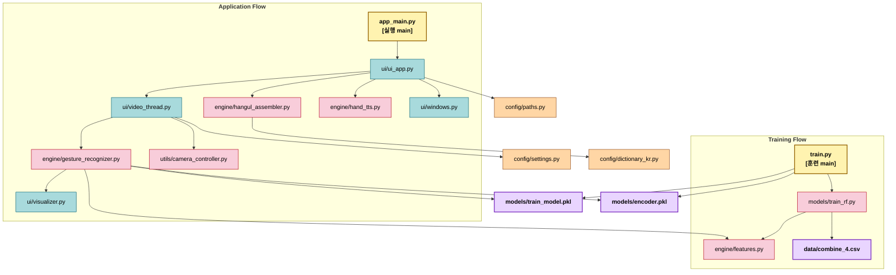

# <span style="color:#97BC62; background-color:#2C5F2D">실시간 수어 번역 프로그램 (Real-time Sign Language Translator)

> 웹캠으로 사용자의 손 제스처를 인식해 한글 자모를 조합하고, 완성된 문장을 텍스트와 음성으로 출력하는 `Python`, `PyQt5`, `MediaPipe`, `scikit-learn` 기반 데스크톱 애플리케이션입니다.

<br>

## <span style="color:#f400fe; background-color:#5e00bc">주요 기능 (Key Features)

* <span style="color:#3daeff; background-color:#00366b">**실시간 손 랜드마크 추출**</span>: `MediaPipe Hands`를 사용해 웹캠 프레임에서 양손 랜드마크를 추적합니다.
* <span style="color:#3daeff; background-color:#00366b">**머신러닝 기반 제스처 분류**</span>: `RandomForestClassifier`로 학습한 모델을 이용해 수어 자모 및 제어 제스처를 예측합니다.
* <span style="color:#3daeff; background-color:#00366b">**한글 자모 조합**</span>: 인식된 결과를 `HangulAssembler`가 조합해 실시간 문장 입력 형태로 보여줍니다.
* <span style="color:#3daeff; background-color:#00366b">**문장 음성 출력**</span>: `end` 제스처가 감지되면 누적된 문장을 `gTTS` 기반 TTS로 읽어줍니다.
* <span style="color:#3daeff; background-color:#00366b">**사용자 설정 UI**</span>: 인식 속도, 랜드마크 표시 여부, TTS 볼륨을 설정 창에서 조정할 수 있습니다.

<br>

## <span style="color:#f400fe; background-color:#5e00bc">시스템 아키텍처 (System Architecture)

이 프로젝트는 <span style="color:#dca400; background-color:#44270e">`UI 레이어`와 `실시간 인식 스레드`를 분리</span>한 구조입니다. `PyQt5` 메인 윈도우는 화면 표시와 텍스트 조합, 설정 제어를 담당하고, `VideoThread`는 카메라 입력과 `GestureRecognizer` 추론을 별도 스레드에서 수행해 UI 멈춤을 줄입니다.



<br>

## <span style="color:#f400fe; background-color:#5e00bc">파일 구조 (File Structure)

프로젝트는 `설정`, `추론 엔진`, `UI`, `유틸리티`를 분리해 <span style="color:#dca400; background-color:#44270e">모듈성</span>과 <span style="color:#dca400; background-color:#44270e">유지보수성</span>을 높인 구조로 구성되어 있습니다.

```text
.
├── app_main.py                   # 애플리케이션 시작점, 모델 로드 후 PyQt 앱 실행
├── train.py                      # 데이터셋으로 모델/인코더를 학습하고 저장
├── requirements.txt              # Python 의존성 목록
├── README.md                     # 프로젝트 문서
│
├── config/                       # 경로, 설정값, 자모 사전 정의
│   ├── dictionary_kr.py          # 한글 자모/조합 관련 상수
│   ├── paths.py                  # 데이터셋, 폰트, 아이콘 경로 정의
│   └── settings.py               # 카메라/인식 속도/임계값 설정
│
├── data/                         # 학습 데이터 및 UI 리소스
│   ├── combine_4.csv             # 제스처 학습 데이터셋
│   ├── hand_img.png              # 도움말 창 이미지
│   ├── 세종머왕.png               # 애플리케이션 아이콘
│   ├── GowunDodum-Regular.ttf    # 한글 시각화 폰트
│   ├── AstaSans-VariableFont_wght.ttf
│   └── ChironGoRoundTC-VariableFont_wght.ttf
│
├── engine/                       # 특징 추출, 인식, 자모 조합, TTS
│   ├── data_model.py             # 제스처 데이터 구조 정의
│   ├── features.py               # 각 손 랜드마크 특징 계산 함수
│   ├── gesture_recognizer.py     # MediaPipe 추론 및 안정화 로직
│   ├── hangul_assembler.py       # 자모를 완성형 한글로 조합
│   └── hand_tts.py               # 문장 음성 출력 처리
│
├── models/                       # 학습 코드와 저장 모델 위치
│   ├── train_rf.py               # RandomForest 학습/평가 코드
│   ├── train_model.pkl           # 저장된 분류 모델
│   └── encoder.pkl               # 저장된 라벨 인코더
│
├── ui/                           # 메인 화면, 스레드, 시각화, 보조 창
│   ├── ui_app.py                 # 메인 UI 및 이벤트 처리
│   ├── video_thread.py           # 카메라/추론용 백그라운드 스레드
│   ├── visualizer.py             # OpenCV 프레임 위 한글 텍스트 렌더링
│   └── windows.py                # 도움말/설정 창 구현
│
└── utils/                        # 카메라 제어 및 설치 보조 기능
    ├── camera_controller.py      # 웹캠 열기, 재연결, 프레임 읽기
    └── installer.py              # 의존성 설치 보조 스크립트
```

<br>

## <span style="color:#f400fe; background-color:#5e00bc">동작 흐름 (Workflow)

1. `app_main.py`가 `models/train_model.pkl`과 `models/encoder.pkl`을 로드합니다.
2. `SignLanguageTranslatorApp`가 메인 창을 띄우고 `VideoThread`를 시작합니다.
3. `VideoThread`가 `CameraController`로 웹캠 프레임을 읽습니다.
4. `GestureRecognizer`가 `MediaPipe Hands`로 양손 랜드마크를 추출하고 특징 벡터를 생성합니다.
5. 학습된 `RandomForest` 모델이 현재 프레임의 제스처를 예측합니다.
6. 최근 결과가 일정 횟수 이상 동일하면 확정 레이블을 UI에 전달합니다.
7. `HangulAssembler`가 레이블을 조합해 입력 중인 한글 문장을 갱신합니다.
8. `end` 제스처가 들어오면 문장을 로그에 추가하고 `HandTTS`가 음성으로 재생합니다.

<br>

## <span style="color:#f400fe; background-color:#5e00bc">주요 모듈 설명 (Core Modules)

### 1. Training Layer

`train.py`와 `models/train_rf.py`는 CSV 데이터셋을 읽어 분류 모델을 학습합니다.

* `train.py`: 학습 실행 진입점이며 결과 모델과 인코더를 `models/`에 저장합니다.
* `models/train_rf.py`: 데이터 로드, 특징 추출, 학습/평가를 수행합니다.
* `engine/features.py`: 각 손의 각도, 거리, 방향 벡터를 계산하는 공용 특징 추출 함수입니다.

### 2. Application UI

`ui/ui_app.py`는 사용자와 직접 상호작용하는 메인 화면입니다.

* `ui/ui_app.py`: 카메라 화면, 텍스트 로그, 입력창, 설정/도움말 버튼을 관리합니다.
* `ui/windows.py`: 설정 창과 도움말 창을 제공합니다.
* `ui/visualizer.py`: OpenCV 프레임 위에 한글 안내 문구를 그립니다.

### 3. Realtime Recognition

실시간 추론은 `VideoThread`와 `GestureRecognizer`가 담당합니다.

* `ui/video_thread.py`: 프레임 수집, pause/resume, 카메라 재연결, UI 시그널 전달을 처리합니다.
* `engine/gesture_recognizer.py`: 손 랜드마크 추출, 특징 생성, 예측, 히스토리 안정화, 화면 표시를 담당합니다.
* `utils/camera_controller.py`: 카메라 장치 열기와 재시도 로직을 캡슐화합니다.

### 4. Text Assembly and TTS

인식 결과를 문장으로 이어붙이고 음성으로 출력하는 모듈입니다.

* `engine/hangul_assembler.py`: 자모 단위 입력을 완성형 한글 텍스트로 조합합니다.
* `engine/hand_tts.py`: 완성된 문장을 음성으로 변환하고 재생 볼륨을 제어합니다.
* `config/dictionary_kr.py`: 조합에 필요한 한글 문자 매핑을 제공합니다.

<br>

## <span style="color:#f400fe; background-color:#5e00bc">설치 및 실행 방법 (Installation & Usage)

### 1. 환경 설정 (Environment Setup)

&emsp;&emsp;**1) 프로젝트 클론**
```bash
git clone <repository-url>
cd Korean-Sign-Language-Translation-Program-main
```

&emsp;&emsp;**2) 가상환경 생성 및 활성화**
```bash
python -m venv venv

# Windows
venv\Scripts\activate

# macOS / Linux
source venv/bin/activate
```

&emsp;&emsp;**3) 의존성 설치**
```bash
pip install -r requirements.txt
```

> **Note**: `PyQt5`, `opencv-python`, `mediapipe`, `scikit-learn`, `joblib`, `gTTS`가 정상 설치되어야 실행할 수 있습니다.

### 2. 모델 학습 (Train the Model)

새 데이터셋으로 모델을 다시 만들려면 아래 명령으로 학습을 수행합니다.

```bash
python train.py
```

실행이 끝나면 `models/train_model.pkl`과 `models/encoder.pkl`이 생성되거나 갱신됩니다.

### 3. 애플리케이션 실행 (Run the Application)

```bash
python app_main.py
```

모델 파일이 없으면 실행 시 먼저 `train.py`를 돌리라는 안내가 출력됩니다.

<br>

## <span style="color:#f400fe; background-color:#5e00bc">운영 시 확인할 설정 (Configuration Notes)

- `config/settings.py`: `CAMERA_INDEX`, `REQ_WIDTH`, `REQ_HEIGHT`, `REC_HISTORY_LEN`, `REC_COOL_TIME`, `CONFIDENCE_THRESHOLD` 값을 환경에 맞게 조정
- `config/paths.py`: 데이터셋, 폰트, 아이콘 경로가 실제 파일 위치와 일치하는지 확인
- `data/combine_4.csv`: 학습 데이터 라벨과 실제 제스처 클래스 구성이 현재 모델 목적과 맞는지 확인
- `models/train_model.pkl`, `models/encoder.pkl`: 현재 데이터셋으로 생성된 최신 파일인지 확인
- 시스템 오디오 환경: `gTTS` 출력 재생이 가능한 오디오 장치와 네트워크 환경 점검

<br>

## <span style="color:#f400fe; background-color:#5e00bc">주요 기술 스택 (Tech Stack)

- **언어**: `Python`
- **GUI 프레임워크**: `PyQt5`
- **영상 처리**: `OpenCV`
- **손 추적**: `MediaPipe Hands`
- **머신러닝**: `scikit-learn`, `RandomForestClassifier`
- **모델 저장**: `joblib`
- **음성 출력**: `gTTS`

<br>

## <span style="color:#f400fe; background-color:#5e00bc">현재 코드베이스 주의사항 (Known Issues)

코드 기준으로 실행 전에 아래 항목을 확인하는 것이 좋습니다.

* <span style="color:#dca400; background-color:#44270e">**모델 파일 선행 필요**</span>: `app_main.py`는 시작 시 `models/train_model.pkl`과 `models/encoder.pkl`이 존재한다고 가정합니다.
* <span style="color:#dca400; background-color:#44270e">**카메라 환경 의존성**</span>: 기본 카메라 인덱스와 해상도 설정이 시스템마다 다를 수 있습니다.
* <span style="color:#dca400; background-color:#44270e">**TTS 네트워크 의존 가능성**</span>: `gTTS` 사용 시 실행 환경에 따라 인터넷 연결 상태의 영향을 받을 수 있습니다.
* <span style="color:#dca400; background-color:#44270e">**데이터셋 문서 부족**</span>: `combine_4.csv`의 클래스 구성과 수집 기준은 README만으로 완전히 파악되지는 않습니다.

<br>

## <span style="color:#f400fe; background-color:#5e00bc">향후 개선 계획 (Future Plans)

- <span style="color:#dca400; background-color:#44270e">**동적 수어 인식 확장**</span>: 정적 자모 중심 인식에서 벗어나 연속 동작 기반 단어/문장 인식으로 확장
- <span style="color:#dca400; background-color:#44270e">**설정 외부화**</span>: 카메라, 임계값, UI 옵션을 별도 설정 파일이나 사용자 프로필로 분리
- <span style="color:#dca400; background-color:#44270e">**모델 고도화**</span>: 더 많은 데이터셋과 대체 분류 모델을 비교해 정확도 향상
- <span style="color:#dca400; background-color:#44270e">**배포 편의성 개선**</span>: 실행 파일 패키징과 설치 자동화 정리
